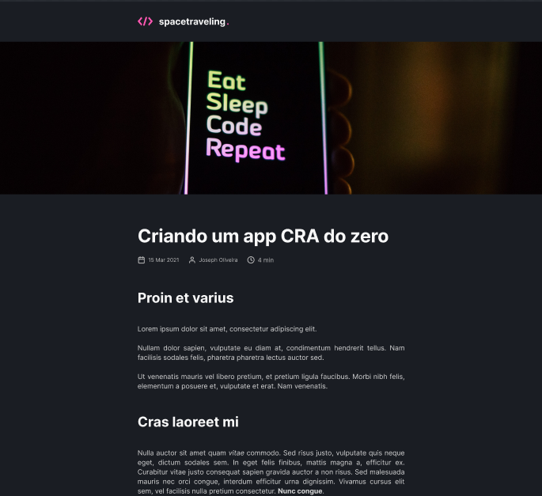

---

## Sobre 

O objetivo do projeto é criar uma aplicação de um blog.

--- 

## 📽️ Imagem do projeto 




--- 

## 💻 Pré-requisitos

Antes de começar, verifique se você atendeu aos seguintes requisitos:
* Você tem uma máquina `<Windows / Linux / Mac>`
* Você instalou a versão mais recente do `NodeJS`


## ⚙️ Instalando

Para instalar execute no terminal:

npm:
```
npm i
```

yarn:
```
yarn install
```

## 🚀 Rodando o projeto

Para rodar o projeto, execute no terminal:

npm:
```
npm run dev
```

yarn:
```
yarn dev
```

## 🚀 Tecnologias utilizadas

O projeto está desenvolvido utilizando as seguintes tecnologias:

- NextJS
- Prismic
- Figma
--- 


